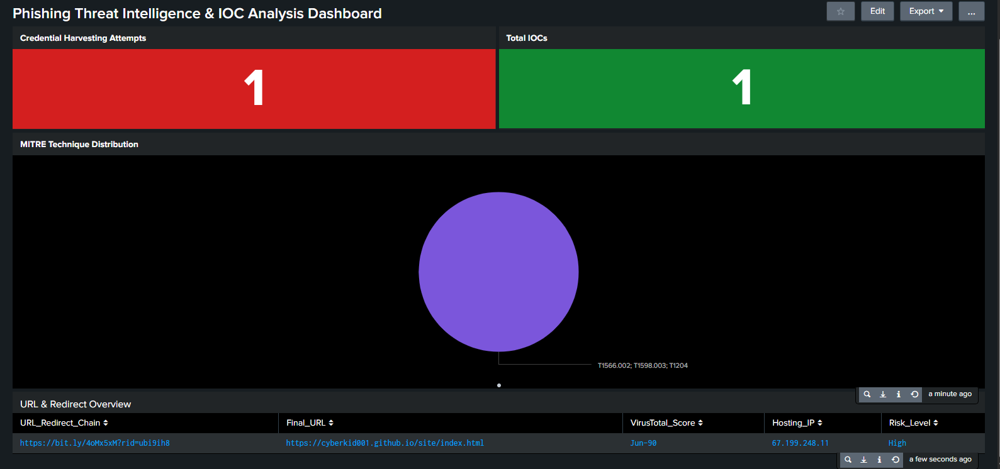

# Phishing Threat Intelligence, Detection & Response Project

> **SOC Operations | Threat Intelligence | Detection Engineering**

---

## Overview
This project documents an end-to-end **Security Operations Center (SOC)** investigation of a real-world **phishing campaign impersonating Google Security Alerts**. The engagement goes beyond basic analysis by operationalizing findings into **Splunk detections and incident response playbooks**, reflecting how modern SOC teams turn intelligence into action.

The phishing campaign leveraged **social engineering**, **URL shortening (Bitly)**, and **abuse of trusted cloud infrastructure (GitHub Pages)** to harvest user credentials while bypassing traditional email authentication controls.

---

## Project Objectives
- Investigate and classify a phishing email
- Extract and validate Indicators of Compromise (IOCs)
- Enrich findings using threat intelligence platforms
- Map adversary behavior to **MITRE ATT&CK**
- Build SOC-style **Splunk dashboards**
- Develop **detections and response procedures** based on findings
- Produce portfolio-ready SOC documentation

---

## Technologies & Tools
- **ANY.RUN** — Sandbox analysis for malware validation  
- **VirusTotal** — Threat intelligence and URL reputation  
- **Splunk Enterprise** — Detection, dashboards, and analytics  
- **WHOIS / DNS Tools** — Infrastructure enrichment  
- **GitHub Pages** — Observed abused hosting platform  

---

## Attack Summary

| Attribute | Details |
|--------|--------|
| **Attack Type** | Phishing (Credential Harvesting) |
| **Impersonated Brand** | Google |
| **Delivery Vector** | Email |
| **Obfuscation Technique** | URL Shortener (Bitly) |
| **Final Hosting Platform** | GitHub Pages |
| **Malware Involved** | No |
| **Overall Risk Level** | High |

---

## Investigation Methodology

### 1. Email Analysis
- Reviewed sender, subject, and message content
- Analyzed email authentication headers
- **SPF, DKIM, and DMARC checks passed**, indicating abuse of a legitimate Gmail account rather than classic spoofing
- Identified urgency-based social engineering language designed to trigger user action

---

### 2. Sandbox Analysis (ANY.RUN)
The email file (`.eml`) was first analyzed in **ANY.RUN** to rule out malware delivery.

- ANY.RUN flagged suspicious behavior when the file triggered Microsoft Outlook
- This behavior was determined to be **expected**, as `.eml` files open in email clients by default
- No malicious payloads, exploits, or secondary execution were observed

**Analyst Judgement:**  
The sandbox alert was classified as a **false positive**, and the threat was determined to be **phishing-only**.

---

### 3. URL & Infrastructure Analysis
- Extracted the shortened URL from the email body
- Resolved the redirection chain
- Identified a fake Google login page designed to harvest credentials
- Collected hosting IP, server headers, and SSL information

---

### 4. Threat Intelligence Enrichment
- VirusTotal analysis of the phishing URL
- **6 out of 98 security vendors flagged the URL as malicious**
- Redirect chain confirmed Bitly → GitHub Pages abuse
- Infrastructure analysis showed abuse of trusted services to evade detection

---

## MITRE ATT&CK Mapping

| Tactic | Technique | Description |
|------|----------|-------------|
| Initial Access | T1566.002 | Spearphishing Link |
| Credential Access | T1598.003 | Credential Harvesting |
| Resource Development | T1583.001 | Abuse of Legitimate Infrastructure |
| Execution | T1204 | User Execution |

---

## Splunk Dashboard Overview

### Panels & Purpose

- **Threat Intelligence Summary (Single Value Panels)**  
  Provides immediate situational awareness by displaying total IOCs, malicious URLs, and credential-harvesting attempts.

- **URL & Redirect Overview (Table Panel)**  
  Displays shortened URLs, redirect chains, final destinations, hosting IPs, and VirusTotal detection ratios to support analyst triage.

- **MITRE Technique Distribution**  
  Visualizes attacker techniques aligned to MITRE ATT&CK, helping analysts understand adversary behavior patterns.

- **High-Risk IOC Table**  
  Lists confirmed high-risk indicators for rapid containment and response actions.

---

## Detection & Response (Operationalization)

Analysis findings were translated into **actionable SOC controls** to demonstrate real-world applicability.

### Detection Engineering
Custom **Splunk detections** were created to:
- Identify known phishing URLs
- Detect credential harvesting activity
- Monitor abuse of URL shortening services
- Align detections with MITRE ATT&CK techniques

Detection logic is documented in:
